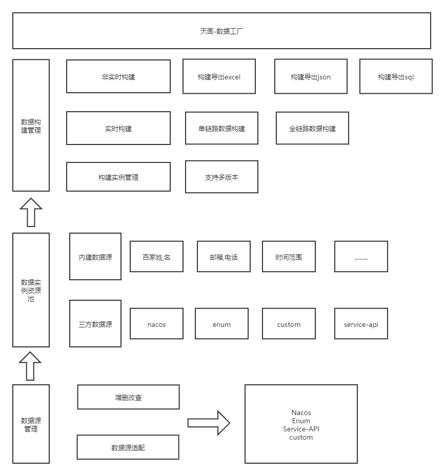
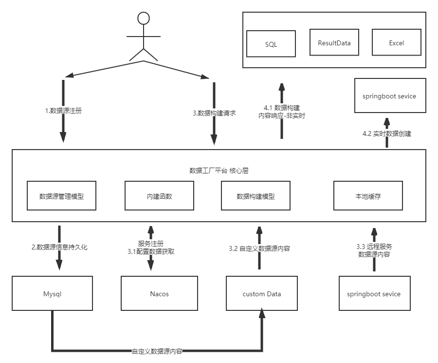
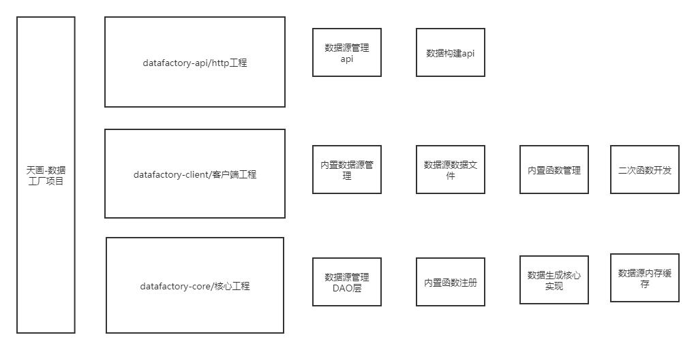

# data-factory

#### 介绍
为大规模微服务构建而创建的业务模拟数据生成平台,属于天画项目中的基础产品 
天画项目链接：https://gitee.com/sky-painting。
data-factory 平台对各个相关服务领域的数据源进行聚合，同时基于业务模型帮助构建大规模大数据量的仿真业务数据。
致力于在分布式微服务等架构落地的同时提供真正的高并发大数据量的实战数据环境。

#### 软件架构
1.  功能架构图
 
2.  数据模型图
3.  应用流程图
 
4.  部署架构图
5.  应用架构图
 

#### 安装教程 

1.  xxxx
2.  xxxx
3.  xxxx

#### 使用api

1.  xxxx
2.  xxxx
3.  xxxx

#### 使用场景

1.  xxxx
2.  xxxx
3.  xxxx

#### 内置数据源列表

1.  BankFunction
2.  CardNumberFunction
3.  PinYinFunction
4.  UserFunction

#### 函数式二次开发

1.  xxxx
2.  xxxx
3.  xxxx

#### 参与贡献

1.  Fork 本仓库
2.  新建 Feat_xxx 分支
3.  提交代码
4.  新建 Pull Request

#### 特技

1.  使用 Readme\_XXX.md 来支持不同的语言，例如 Readme\_en.md, Readme\_zh.md
2.  Gitee 官方博客 [blog.gitee.com](https://blog.gitee.com)
3.  你可以 [https://gitee.com/explore](https://gitee.com/explore) 这个地址来了解 Gitee 上的优秀开源项目
4.  [GVP](https://gitee.com/gvp) 全称是 Gitee 最有价值开源项目，是综合评定出的优秀开源项目
5.  Gitee 官方提供的使用手册 [https://gitee.com/help](https://gitee.com/help)
6.  Gitee 封面人物是一档用来展示 Gitee 会员风采的栏目 [https://gitee.com/gitee-stars/](https://gitee.com/gitee-stars/)

