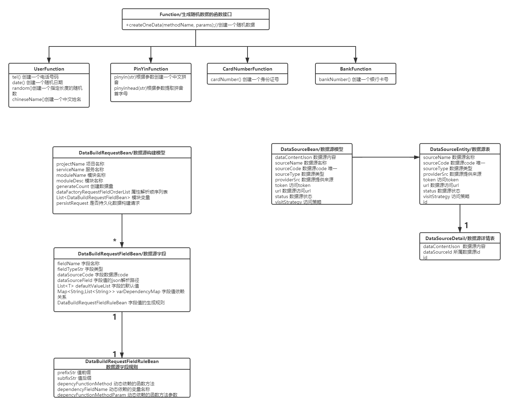

# data-factory

#### 介绍
为大规模微服务构建而创建的业务模拟数据生成平台,属于天画项目中的基础产品 
天画项目链接：https://gitee.com/sky-painting。
data-factory 平台对各个相关服务领域的数据源进行聚合，同时基于业务模型帮助构建大规模大数据量的仿真业务数据。
致力于在分布式微服务等架构落地的同时提供真正的高并发大数据量的实战数据环境。

#### 软件架构-1.0
1.  功能架构图
 
2.  数据模型图
 
3.  应用流程图
 
4.  部署架构图
5.  应用架构图
 

#### 安装教程 

1.  通过sql文件中的sql脚本初始化
2.  克隆本项目，并搭建本地nacos集群,进行服务注册调试
3.  克隆https://gitee.com/codergit.com/javautils 工具类，并install coderman-utils(1.0.5版本)
4.  运行api工程中的DataSourceControllerTest,DataFactoryControllerTest 测试服务即可看到随机数据

#### 使用api

1.  /data/source/regist  注册数据源
2.  /datafactory/generate/simple  构建简单数据源
3.  xxxx

#### 使用场景

1.  xxxx
2.  xxxx
3.  xxxx

#### 内置数据源列表

#####  BankFunction
银行卡号生成
#####  CardNumberFunction
身份证号生成
#####  PinYinFunction
汉字转拼音,提取首字母
#####  UserFunction
电话,随机数,日期,姓名
##### PassWordFunction
随机N位密码

#### 函数式客户端开发架构
##### 函数服务设计
将内置函数实现与内置随机数据文件迁移到client工程,core工程只通过接口依赖client端函数和实现
因此core的迭代和开发不受随机函数的迭代开发影响。随机函数在客户端可以通过下面的步骤进行开发并可快速集成到core中
client端无需感知core端变化，因此服务设计上更加灵活。同时通过接口和门面模式将client与core进行隔离，达到高内聚低耦合的特性。
##### 二次开发步骤
1.  在datafactory-client工程中的InnerDataSourceCode定义
唯一的内置数据源dataSourceCode.
2.  在FileDataEnums增加文件名，描述枚举
3.  在resources/defaultfactory中增加内置数据源文件.txt
4.  实现com.coderman.tianhua.datafactory.client.function.Function接口,这里可以单独做单元测试
5.  在接口实现类的随机数据方法上增加DataSourceFunction注解，标注对应的新增的内置数据源
6.  启动nacos服务，并在datafactory-api中编写单元测试，引入该新增的内置数据源
7.  测试新增的内置数据源函数是否正常在整个数据构建中生效

#### 版本发布

#####  1.0.0-SNAPSHOT
本次发版为基本雏形版本，内容:
1.  数据源增删改查
2.  内置多个基本随机数据函数
3.  初步工程架构定型(api依赖core,core依赖client)
4.  内部核心模块解耦,方便二次开发
5.  生成随机数据的核心功能完成
6.  生成数据的依赖数据源全面打通(自定义数据源,NACOS,内置数据源,spring boot api)

#### 参与贡献

1.  Fork 本仓库
2.  新建 Feat_xxx 分支
3.  提交代码
4.  新建 Pull Request

#### 特技

1.  使用 Readme\_XXX.md 来支持不同的语言，例如 Readme\_en.md, Readme\_zh.md
2.  Gitee 官方博客 [blog.gitee.com](https://blog.gitee.com)
3.  你可以 [https://gitee.com/explore](https://gitee.com/explore) 这个地址来了解 Gitee 上的优秀开源项目
4.  [GVP](https://gitee.com/gvp) 全称是 Gitee 最有价值开源项目，是综合评定出的优秀开源项目
5.  Gitee 官方提供的使用手册 [https://gitee.com/help](https://gitee.com/help)
6.  Gitee 封面人物是一档用来展示 Gitee 会员风采的栏目 [https://gitee.com/gitee-stars/](https://gitee.com/gitee-stars/)

